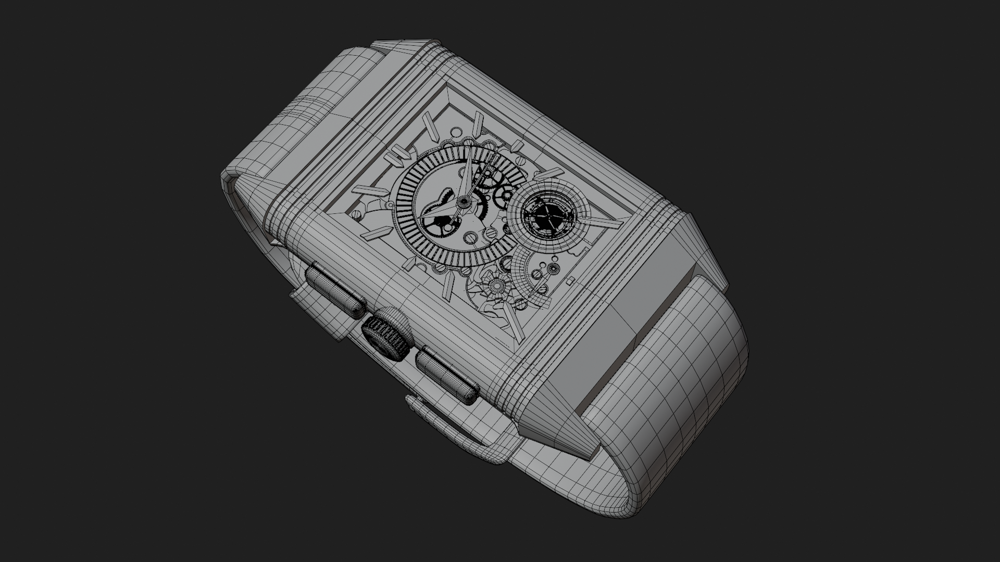
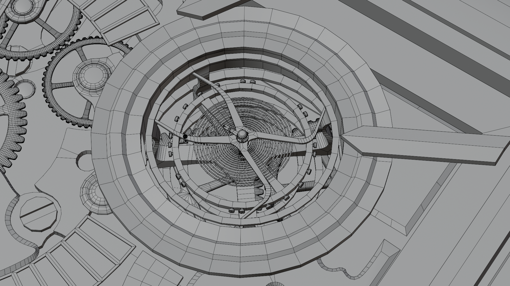

# JAEGER-LECOULTRE WATCH — 3D MODEL

<table>
<tr>
<td></td>
<td></td>
</tr>
</table>

## Overview

A detailed 3D model of a Jaeger-LeCoultre watch, modeled and assembled from scratch in Blender using reference images collected from the internet and Pinterest.

The project focused on recreating both the exterior design and the internal mechanical details of the watch, including the movement and tourbillon mechanism.

<table>
<tr>
<td></td>
<td></td>
</tr>
</table>

## Modeling

<table>
  <tr>
    <td></td>
    <td></td>
  </tr>
</table>

* **Watch Body:** Modeled the main watch case and refined the overall shape using the reference images.
* **Interior & Movement:** Built the internal mechanical components and detailed the visible parts of the watch movement.
* **Tourbillon:** Added and modeled the tourbillon mechanism as one of the main mechanical features.
* **Leather Strap:** Created the leather straps and shaped them to fit the watch case.
* **Details:** Added smaller components, mechanical elements, and other details to make the watch more complete and realistic.

## Materials & Textures

Created custom materials and textures for the different parts of the watch.

The final material setup includes **gold, black, silver, and leather** elements, with additional surface details added to improve the overall appearance of the model.

## Animation

The mechanical parts of the watch were animated to demonstrate how the movement works.

The animation focuses on the movement of the internal components and the tourbillon mechanism, allowing the model to be presented as an interactive mechanical demonstration.

## Demos

**3D Model:** [View the 3D MODEL on Sketchfab](https://sketchfab.com/3d-models/jaeger-le-coultre-watch-5a2b0692697c4818b1113ff4c9162566)

## License

Licensed under **CC BY-NC 4.0**.
You may use, modify, and share this project for **non-commercial purposes**, with credit to **Binupa**.

**Commercial use or resale requires permission.**

[View the full CC BY-NC 4.0 license](https://creativecommons.org/licenses/by-nc/4.0/)

## Project Info

* **Software:** Blender
* **Type:** 3D Product Model
* **Focus:** Modeling, Mechanical Details, Texturing & Animation
* **Time Spent:** ~25 hours
* **Status:** Completed
